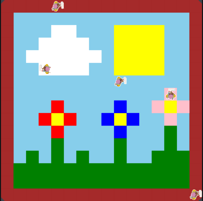

# Unit-1-Asphalt-Art-Project
## Introduction

Cities use asphalt art to improve public safety, inspire their residents and visitors, and brighten communities. Your goal is to create asphalt art to revitalize The Neighborhood and bring the community together with the help of the Painter.

## Requirements

Use your knowledge of object-oriented programming, algorithms, the problem solving process, and decomposition strategies to create asphalt art:
- **Create a new subclass** – Create at least one new subclass of the PainterPlus class that is used for a component of the asphalt art design.
- **Plan an algorithm** – Use the problem solving process and decomposition strategies to plan an algorithm that incorporates a combination of sequencing, selection, and/or iteration.
- **Write a method** – Write at least one method in a PainterPlus subclass that contributes to a component of the asphalt art design.
- **Document your code** – Use comments to explain the purpose of the methods and code segments.

## Notes: Neighborhood & Painter Class

This project was created on Code.org's JavaLab platform using the built-in Neighborhood GUI output. To test and edit this project you must build in Code.org's JavaLab with the Neighborhood GUI enabled. For reference to the Painter class documentation, [you can read more here.](https://studio.code.org/docs/ide/javalab/classes/Painter)

## Output:

 

## Reflection

1. Describe your project.

   - My project is a drawing of a landscape that includes a frame, three flowers, red, blue, and pink, the sun, and a cloud.

2. What are two things about your project that you are proud of?

   - Two things about my project that I am proud of is the way I was able to write the algorithm for the sun. I had to think of a creative way to paint the sun without using redundant code. Another thing I am proud of is the way I painted the sky, because I was able to figure out a way to make almost everything sky blue without painting over the other parts of the painting.

3. Describe something you would improve or do differently if you had an opportunity to change something about your project.

   - Something I would do differently if I had an opportunity to change something about my project is seperate the grass and flower into two different subclasses, because in the project, they are created in one class, which made the code long, so I wish I was able to split it into two so I just don't have one long code for one class.
